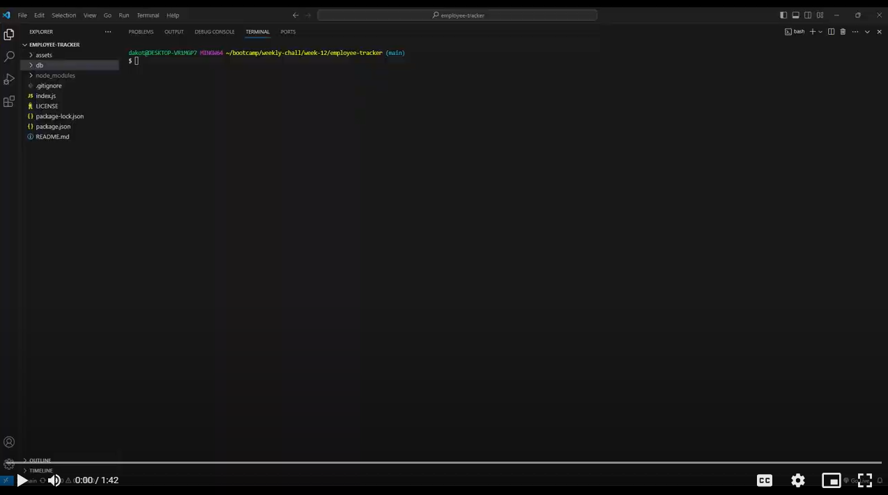

# Employee Tracker

## Table Of Contents
* [Description](#description)
* [Installation and Startup](#installation-and-startup)
* [Demo](#demo)
* [Tools](#tools)
* [License](#license)

## Description
Simple content management system for an employee database.

## Installation and Startup
1. Make sure to have [MySQL](https://www.mysql.com/) and [Node.js](https://nodejs.org/en) installed before continuing
2. Download code files
3. Navigate your CLI to the folder containing the code files
4. Run the code `npm i` to install dependencies
5. Navigate your CLI to the db folder
6. Enter `mysql -u root -p` and enter your MySQL password when prompted
6. Once in MySQL, run the code `source schema.sql` to save the schematics of the database to your computer
7. Exit MySQL by typing `quit`
8. Navigate your CLI back out of the db folder, and into the main folder containing all the code files (probably titled employee-tracker)
9. Run the code `node index.js` to start the application

## Demo

## Tools
* [MySQL](https://www.mysql.com/)
* [Node.js](https://nodejs.org/en)
* [Inquirer](https://www.npmjs.com/package/inquirer)

## License
